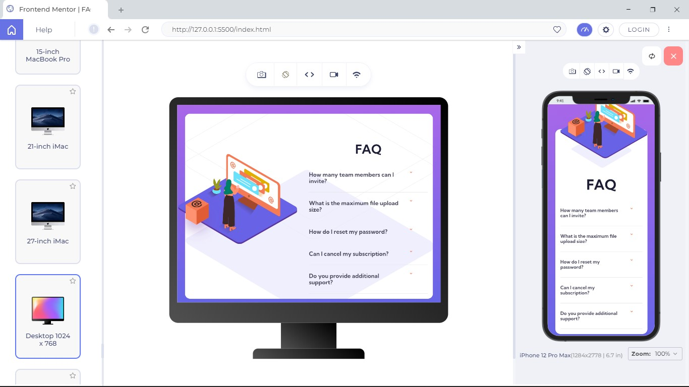
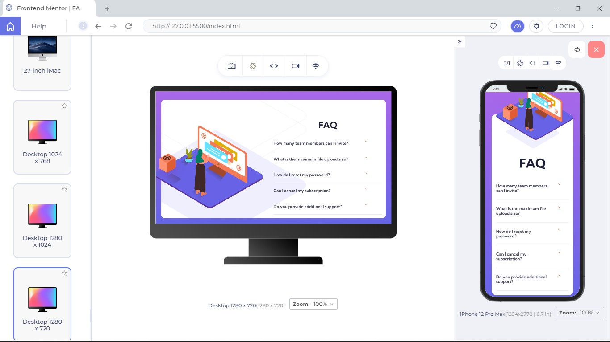

# Frontend Mentor - FAQ accordion card solution

This is a solution to the [FAQ accordion card challenge on Frontend Mentor](https://www.frontendmentor.io/challenges/faq-accordion-card-XlyjD0Oam). Frontend Mentor challenges help you improve your coding skills by building realistic projects. 

## Table of contents

- [Overview](#overview)
  - [The challenge](#the-challenge)
  - [Screenshot](#screenshot)
  - [Links](#links)
- [My process](#my-process)
  - [Built with](#built-with)
  - [What I learned](#what-i-learned)
  - [Continued development](#continued-development)
  - [Useful resources](#useful-resources)
- [Author](#author)
- [Acknowledgments](#acknowledgments)


## Overview

### The challenge

Users should be able to:

- View the optimal layout for the component depending on their device's screen size
- See hover states for all interactive elements on the page
- Hide/Show the answer to a question when the question is clicked

### Screenshot




### Links

- Solution URL: [Add solution URL here](https://your-solution-url.com)
- Live Site URL: [Add live site URL here](https://your-live-site-url.com)

## My process

### Built with

- Semantic HTML5 markup
- CSS custom properties
- Flexbox
- CSS Grid
- Mobile-first workflow
- Javascript


### What I learned

one of the major thinks i learnt was how to structure my code and also get more inside knowledge on how javascript process the code. i had difficulty at first in making the current answer to close when another question was clicked on and i was able to achieve the desired result.

``` js

faqQuestions.forEach(function(question){
    question.addEventListener("click", function(event){
        event.preventDefault();

        faqQuestions.forEach(function(allquestion){
            allquestion.style.color = "var(--Very-dark-grayish-blue)"; 
        })
        faqAnswers.forEach(function(result){
            result.style.display = "none"
        })

        icons.forEach(function(icon){
            icon.className = "arrow-down"
        })

        this.style.color = "var(--Very-dark-desaturated-blue)";
        const clicked = this.getAttribute("href");
        const answer = document.querySelector(clicked)
        const clickedIcon = document.querySelector(`${clicked}icon`)

        
        answer.style.display = "block"
        clickedIcon.classList.add("clicked-arrow-down")
        
    })
})
```

### Continued development

### Useful resources

## Author

- Github - [Olaoye Praise](https://github.com/Praixx)
- Email - [Olaoye Praise](praix1y@gmail.com)
- Twitter - [@Praixx_](https://www.twitter.com/Praixx_)

## Acknowledgments


